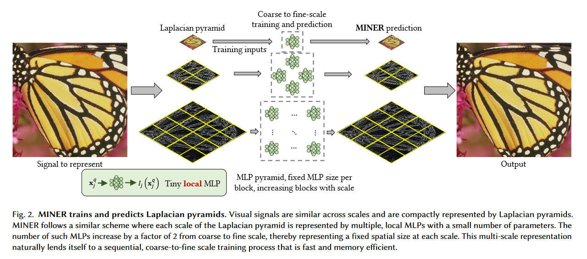
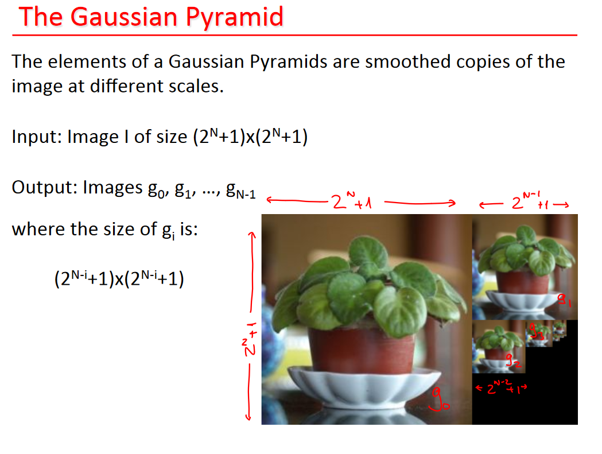
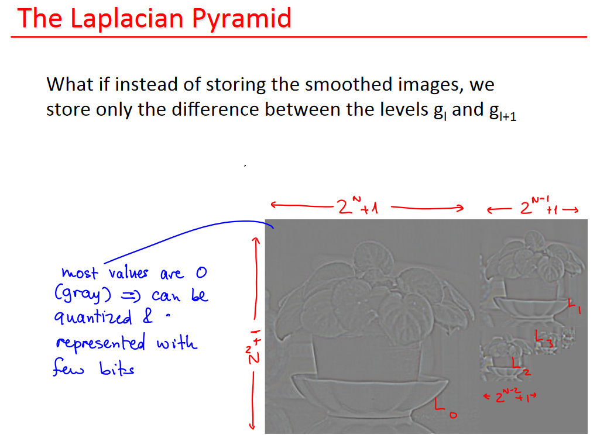
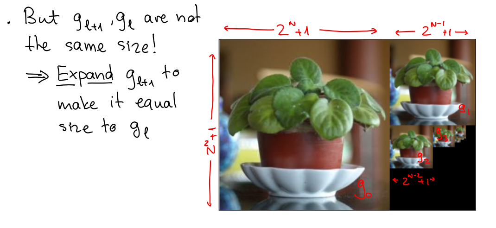
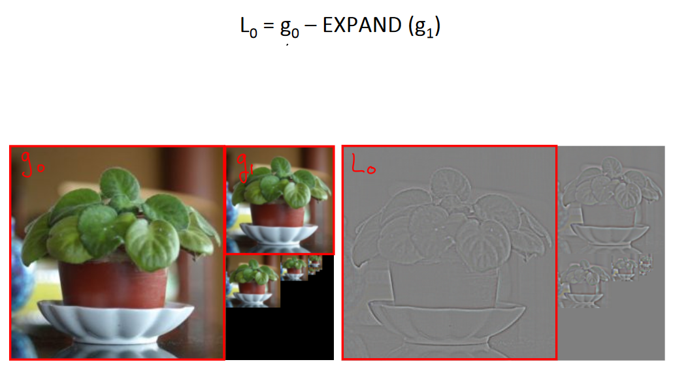
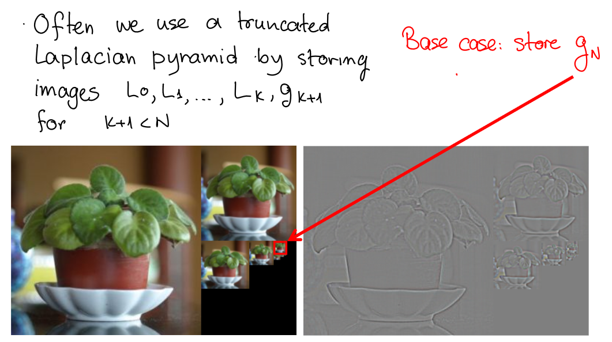

# MINER

## Intro

Unofficial Pytorch-lightning implement of [MINER: Multiscale Implicit Neural Representations](https://arxiv.org/abs/2202.03532)(Siggraph2022)

## How it work?

### What's Gaussian pyramids?

In a Gaussian pyramid, subsequent images are weighted down using a Gaussian average ([Gaussian blur](https://en.wikipedia.org/wiki/Gaussian_blur)) and scaled down. Each pixel containing a local average corresponds to a neighborhood pixel on a lower level of the pyramid. This technique is  used especially in [texture synthesis](https://en.wikipedia.org/wiki/Texture_synthesis).

### What's Laplacian pyramids?

A Laplacian pyramid is very similar to a Gaussian pyramid but saves the difference image of the blurred versions between each levels. Only the smallest level is not a difference image to enable reconstruction of the high resolution image using the difference images on higher levels. This technique can be used in [image compression](https://en.wikipedia.org/wiki/Image_compression).

Given an input image of $(2^N+1) \times (2^N+1)$, the Laplacian pyramid representation consists of :

- $L_0, ...,L_{k-1}$ 
- $g_k$ for some $K\le N$

Moreover

- $L_l = g_l - \text{EXPAND}(g_{l+1})$
- $\text{EXPAND}(g_l) = 4\sum^2_{m=-2}\sum^2_{n=-2}w(m,n)g_l(\frac{i-m}{2},\frac{j-n}{2}  )$

## How to setup?

### Data preparation

- build a directory  called "data/"
- make sure your own images put in "data/"
- Data used in My Experiment: 
  - **NASA's Pluto image**: [NASA](https://solarsystem.nasa.gov/resources/933/true-colors-of-pluto/?category=planets/dwarf-planets_pluto)
  - **My rendering artwork**: [geo](https://fusheng-ji.github.io/render_arts/imgs/geo.png)

## Acknowledgement

Thanks for all the contributors below!

kwea123's repo: https://github.com/kwea123/MINER_pl

kwea123's videos: [YouTube](https://www.youtube.com/watch?v=MSVEhq67Ca4)

Wikipedia: [Pyramid (image processing)](https://en.wikipedia.org/wiki/Pyramid_(image_processing))

University of Toronto CSC320 slides: https://www.cs.toronto.edu/~mangas/teaching/320/slides/CSC320L10.pdf

